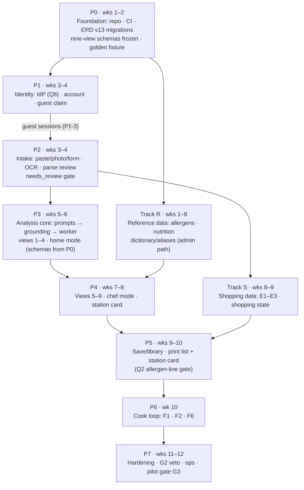

# Recipe Systems — Build Plan

**Status:** v1.0 · 2026-09-04 · **Companions:** [SCAFFOLD.md](SCAFFOLD.md) (conventions) · [TEST_PLAN.md](TEST_PLAN.md) (binding gates)
**Sources:** `Recipe_Systems.md` §13/§16 (12-week schedule + 50-story index) · `Recipe_Systems_ERD_FINAL.md` v13 · ADR-001 · Tech Stack
**Purpose:** Dependency-correct build sequence for the 12-week pilot. `Recipe_Systems.md` §13 gives a weekly delivery schedule, not a dependency graph; this plan preserves its week targets while stating the phase order the schedule implies but never writes down, and positions Keycloak.

---

## 1. Sequencing principles

1. **Dependencies only.** A phase starts when its inputs exist — not when its calendar week arrives. (The nine-view schemas gate prompts; prompts gate grounding; the corrected recipe object gates analysis.)
2. **Contracts before generators.** The nine views "are the product. They are contracts" (Recipe_Systems §3), and the source's week 1–2 deliverable is "lens contracts frozen" (§13) — so the nine-view JSON schemas freeze in **P0**, weeks 1–2, before any prompt or grounding code exists (P3 consumes them).
3. **One-writer rule shapes workstreams** (ADR §2): Web API, Analysis worker, Render, and Admin touch disjoint tables — parallel tracks cannot merge-conflict by construction. Q4 (SCAFFOLD §7) must be answered before P2 ships draft lines; Q5 before Track R starts curating the dictionary that P2's sense confirmation reads.
4. **Golden fixture from day one.** The Kanyakumari card lives in CI from P0 (ERD §16, ADR §9); it never waits for the worker.
5. **Reference data is lead time.** Allergen and nutrition data are curated, reviewed, versioned (ADR §7) — the import path starts in week 1 because it feeds P4 and cannot be rushed in week 7.

## 2. Phase graph

**Critical path: P0 → P1 → P2 → P3 → P4 → P5 → P6 → P7.** Track R feeds P4 and Track S feeds P5 but neither blocks the spine. P2 depends on P1's guest sessions only — the IdP choice (Q8) does not gate intake. The analysis core (P3) is the riskiest node: prompts and grounding must both land inside weeks 5–6, consuming the schemas frozen at P0.

## 3. The spine

### P0 — Foundation (wks 1–2)

| # | Work | Source |
|---|---|---|
| P0-1 | Monorepo per SCAFFOLD §1; GitHub Actions CI | Tech Stack §20/§22 |
| P0-2 | `prisma migrate deploy` green on ephemeral Postgres: all ERD v13 DDL including constraints, partial indexes, exclusion constraints, trigger | ERD §5–§10, §12 |
| P0-3 | `tests/fixtures/golden_kanyakumari_card.json` + `golden_recipe_assertions.yaml` (8 invariants) scaffolded in CI | ERD §16 |
| P0-4 | 50-recipe fixture corpus started; regional reviewers signed | Recipe_Systems §13 |
| P0-5 | Nine-view JSON schemas frozen in `packages/schemas` (view payloads, claims, identification, station-card sections) — the source's week 1–2 "lens contracts frozen" | Recipe_Systems §13; ERD §15.8 |

**Exit:** migrations apply clean; lens contracts frozen; golden fixture loads; CI lint→typecheck→unit→migrate→build runs on every PR.
**Not needed yet:** analysis worker, the IdP (Keycloak under Q8), UI beyond a shell.

### P1 — Identity & account (wks 3–4)

| # | Work | Source |
|---|---|---|
| P1-1 | IdP setup per Q8: Keycloak realm `recipesystems` + realm export in `infra/keycloak/` under the working assumption (not started before P1); Auth0 tenant configuration if Q8 lands there instead | BUILD_PLAN §5 |
| P1-2 | OIDC → HTTP-only cookie sessions; `account` creation with `preferred_mode`, `label_pack` | Tech Stack §14; ERD `account` |
| P1-3 | Guest sessions + A2 claim transaction (idempotent; guest row preserved as audit) | ADR §5; ERD §13 |
| P1-4 | Ownership enforcement on every recipe/account/guest read and write (INV-17); XOR invariant (INV-02) | ADR §20; ERD §5 |

**Exit:** register/sign-in works; a guest can ingest and later claim; `chk_recipe_owner_xor` holds under test.
**Not needed yet:** OCR, analysis.

### P2 — Intake (wks 3–4, needs P1)

| # | Work | Source |
|---|---|---|
| P2-1 | `recipe_input` immutable raw rows (paste/photo/form); photo → object storage, URI only | ERD `recipe_input`; ADR §3 |
| P2-2 | OCR adapter (GCV candidate); `ocr_text`, `needs_review`, `ocr_confidence` on draft lines; low-confidence lines flagged, never dropped (INV-04) | Tech Stack §11; ERD §5 |
| P2-3 | Parse review: edit/add/delete/split/merge, mark headers, confirm senses (B3); the two fenugreek lines survive | Recipe_Systems §12 B3 |
| P2-4 | Method attach (B4): absent method → Views 3/7 INCOMPLETE; matched family method tagged INFERRED with named source | Recipe_Systems §3.4, B4 |
| P2-5 | Analysis enqueue blocked while any active line has `needs_review = TRUE` (INV-05) | ADR §3 |

**Exit:** golden card photographed → flagged lines → corrected object; analysis refuses to enqueue until review is clean.
**Not needed yet:** any analysis logic.

### P3 — Analysis core (wks 5–6)

Inputs: the nine-view schemas frozen at P0.

| # | Work | Source |
|---|---|---|
| P3-1 | Prompt spec per view + home/chef system prompts, validated against the frozen schemas; `prompt_version` persisted per analysis | ERD `analysis.prompt_version` |
| P3-2 | Grounding validator: reference resolution against captured lines, ABSENT rule, regenerate-once, INCOMPLETE marking | ADR §6; INV-10 |
| P3-3 | Worker: pg-boss jobs, idempotent (INV-11), captured input state (Q1 pending), retry/backoff (Q13: pilot defaults set here, revalidated at P7), SSE status | ADR §5/§14; Tech Stack §9/§13 |
| P3-4 | Views 1–4 + identification (C1) + claim tags (C4) + home mode; the View 2 coriander blind-spot is output, not a bug | Recipe_Systems §6 |

**Exit:** golden fixture passes all 8 CI invariants; grounding failure → view INCOMPLETE, never current (INV-10); failed jobs never stuck at `generating`.
**Not needed yet:** views 5–9, chef mode.

### P4 — Analysis complete (wks 7–8, needs P3 + Track R)

| # | Work | Source |
|---|---|---|
| P4-1 | Views 5–9; View 8 against `dietary_allergen_definition`/`mapping` (H2 via `analysis_claim.allergen_id`); View 9 bands from `nutrition_food_composition_*` (I1/I2) | ERD §9/§10 |
| P4-2 | Chef mode + station card (C3/C5): mise, sequence, do-nots, control points, product-yield-hold | ERD `analysis_station_card` |
| P4-3 | Disclaimers on every surface (H6/I6); "safe" forbidden (INV-13); point-kcal forbidden (INV-14) | Recipe_Systems §6 View 8/9 |

**Exit:** week-8 gate prep — Kumari vs inland Tamil vs Kerala kudampuli separable, zero invented ingredients (G3, Recipe_Systems §10).

### P5 — Save, shop, print (wks 9–10, needs P2 + P4 + Q2)

| # | Work | Source |
|---|---|---|
| P5-1 | Library: save (D1), browse (D2), delete — hard DELETE cascade (D6) | ERD §13 |
| P5-2 | Print list + station card via Playwright templates, snapshot-only reads (INV-12), allergen line included (H4) — **gated on Q2** | ADR §7; E4/E5 |

**Exit:** both prints fit one page, allergen line present, prints do not change after a later recipe edit.

### P6 — Cook loop (wk 10)

| # | Work | Source |
|---|---|---|
| P6-1 | Log cook (F1), rating + note (F2), last-cook + next-time surfaced on reopen (F6) | ERD `cook_log` |

**Exit:** acceptance-scene cook step runs: log, rate, next-time line visible on reopen (Recipe_Systems §15).

### P7 — Hardening & pilot (wks 11–12)

| # | Work | Source |
|---|---|---|
| P7-1 | Aliases (B6), tags/search (D3), edit + re-analyse with snapshot chain (D4/D5/C6) | ERD §13 |
| P7-2 | Restriction profiles (H1/H3/H5), swaps (F3), next-time field (F4), assumption editors (I3/I4) | Recipe_Systems §12 |
| P7-3 | G2 regional veto workflow; retention/cleanup jobs; ops docs land here | ADR §8 |
| P7-4 | Week-12 pilot: 20 users, golden + 20 messy recipes, go/no-go metrics | Recipe_Systems §14 |

**Exit:** go metrics — zero invented ingredients on the golden fixture, three curries separable in chef mode, prints fit one page, photo→first analysis under 2 minutes including parse correction, no "safe", no point-kcal (§14).

## 4. The tracks

### Track R — Reference data (wks 1–8, feeds P4)

Admin/reference-data module is the sole writer of `dietary_allergen_definition`, `dietary_allergen_mapping`, `nutrition_food_composition_*`, and (working assumption pending Q5) `ingredient_dictionary` / `ingredient_alias`. Reviewed CSV/JSON import → diff → human approval → effective-dated version (ADR §7); `EXCLUDE USING gist` rejects overlaps (ERD §9/§10). Sources: US/EU statutory allergen lists, USDA FoodData Central (H7/I7).
**Exit:** allergen + nutrition data loaded via the reviewed path; an unreviewed mapping change cannot silently alter every recipe's View 8/9.

### Track S — Shopping data (wks 8–9, feeds P5)

E1–E3 + `ingredient_shopping_state` with the composite FK to `recipe_ingredient_line(recipe_id, shopping_key)` (ERD §7). Shopping state survives list regeneration and line soft-delete cleanup (C-28 trigger).

## 5. IdP position — Keycloak working assumption (Q8)

| Aspect | Position |
|---|---|
| Phase | P1 — container in compose, realm export in `infra/keycloak/`. **Not started before P1; do not start Keycloak yet.** (Q8 working assumption — the source stack names Auth0, not Keycloak) |
| Role | External trust boundary (ADR §10 `IDP` node). Owns credential lifecycle, password reset, email verification, OAuth/SSO, MFA — the Tech Stack §14 IdP list. This row holds for whichever IdP Q8 selects |
| App still owns | `account`, `guest_session`, recipe ownership, guest claiming, application authorization (ADR §19) — zero ERD impact |
| Sessions | Keycloak authenticates at the boundary; the app issues secure HTTP-only cookies (Tech Stack §1/§14) |
| Datastore | Dev: `keycloak` database in the compose Postgres (dev convention, Q8-dependent). Production: separate database on the managed Postgres instance (least-infra option) — **OPEN DECISION**, confirm at the P7 ops review |
| Ops burden | Backups ride Postgres PITR; realm export versioned in git; admin console restricted at Nginx; upgrades scheduled in pilot maintenance windows (Keycloak-specific; N/A if Auth0 wins) |
| Reconciliation | Tech Stack §1/§14/§25 still say "Auth0 recommended". Until amended, Keycloak is the pilot working assumption and Auth0 the managed fallback — **OPEN DECISION (Q8)** |

## 6. Story-to-phase map (50/50 ledger)

Every story in the §16 Story Index is scheduled exactly once:

| Phase/Track | Stories |
|---|---|
| P0 | G1 (CI harness; runs on every phase thereafter) |
| P1 | A1, A2 |
| P2 | B1, B2, B3, B4, B5 |
| P3 | C1, C2 (views 1–4; views 5–9 complete in P4), C4 |
| P4 | C3, C5, H2, H6, I1, I2, I6 |
| P5 | D1, D2, D6, E4, E5, H4 |
| P6 | F1, F2, F6 |
| P7 | B6, C6, C7, D3, D4, D5, E6, F3, F4, F5, G2, G3, H1, H3, H5, I3, I4, I5 |
| Track R | H7, I7 |
| Track S | E1, E2, E3 (data layer; printed surface ships in P5) |

Could-haves (C7, E6, F5, I5) ship only if Must stories on weeks 9–10 are stable (Recipe_Systems §13).

## 7. Open sequencing risks

1. **Q2 allergen print line** gates P5 print (weeks 9–10) — decide by week 8. **Q3** (ADR `Worker → OCR` edge) is a one-line diagram patch — confirm before P2 OCR work.
2. **Q1 snapshot persistence** gates P3 worker finalization — decide by week 5.
3. **Q9/Q10 provider benchmarks** — corpus + real-card photos must be benchmarked in weeks 1–4 so the model/OCR choice lands before P3/P2 ship.
4. **Reference-data sourcing** (USDA access, US/EU lists) is pure lead time — Track R starts week 1.
5. **Keycloak vs Auth0 reconciliation (Q8)** — P1 builds against the OIDC boundary either way; the compose/realm work is Keycloak-specific and would be discarded if Auth0 wins.
6. **Managed Postgres + S3 procurement (Q7)** — lead time; compose/MinIO cover development until it lands.
7. **Q11/Q12/Q13 operational values** (TTL, RPO/RTO, retries) — needed before P7; defaults documented in the ops docs.
8. **I3 portions** — defer to the View 9 payload (Q14); revisit post-pilot.
9. **Reviewer staffing** — the two regional reviewers are people with calendars (Recipe_Systems §13, weeks 1–2); G2/G3 depend on them.
