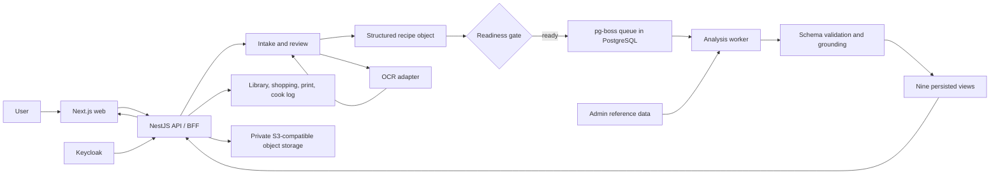

# Recipe Systems

Recipe Systems turns typed, pasted, or photographed recipe cards into a structured, reviewable
briefing. It preserves the captured recipe object, gates analysis on human review, and renders
nine fixed views for home cooks and chef-mode use. It is an analysis product, not a recipe
generator: the grounding contract forbids analysis from inventing ingredients absent from the
structured recipe.

This repository contains the working monorepo and canonical product, architecture, data, testing,
and dispatch documentation. The project is in pilot validation; this README does not claim a
production-ready SaaS deployment.

## Overview

The implemented workflow is:

1. A user enters a recipe as text, a form, or a photograph.
2. Intake persists the raw input and builds a structured ingredient object. Photo input goes
   through the provider-neutral OCR adapter.
3. The review surface shows ingredient lines, provenance, and `needs_review` flags. Analysis is
   blocked while active lines require review; clearing the flag makes readiness explicit.
4. A method can be supplied directly or accepted as a named-source `INFERRED` method. Without a
   method, list-only analysis keeps method-dependent views incomplete.
5. The API enqueues an analysis job. The separate worker consumes it from Postgres-backed pg-boss
   queues, validates and grounds each generated view, and persists the result.
6. The UI presents nine views in Home or Chef mode, plus a station card, shopping list, print
   surfaces, library persistence, and after-cook notes where those flows are available.

The nine views cover ingredient roles, taste pillars, process and timing, structure, regional
context, ratios, sensory/time behavior, dietary analysis, and nutrition bands.

## Key Capabilities

- Text, structured, and photo intake with a reviewable parse.
- OCR lines are retained; low-confidence or confidence-absent lines require review.
- Method attachment with `METHOD`, named-source `INFERRED`, and list-only behavior.
- Nine-view analysis with Home and Chef presentation modes.
- Grounding, provenance tags, explicit incomplete states, and deterministic View 8/9 safeguards.
- Save, library browse, shopping state, print templates, and cook-log recall.
- Regional View 5 veto with an idempotent `COMPLETE` to `INCOMPLETE` transition.
- Keycloak authentication, guest sessions, CSRF protection, and account-scoped access.

## How It Works



The API/BFF handles synchronous HTTP work. Analysis is asynchronous: the API enqueues a job, the
worker consumes it, and the browser observes durable status through API polling/SSE surfaces.
PostgreSQL is the source of truth; notifications are signals, not analysis records.

## Architecture

The pilot architecture is a modular monolith with one separate analysis-worker process. Logical
boundaries remain explicit even when modules share the API process and database.

| Boundary | Responsibility | Primary writes |
|---|---|---|
| Web/API BFF | Auth integration, ownership, recipes, library, tags, restrictions, shopping, cook loop | Account, guest, recipe, tag, restriction, shopping, cook-log tables |
| Intake | Raw input, OCR orchestration, draft lines, parse review | `recipe_input`, `recipe_ingredient_line` |
| Analysis worker | Nine-view generation, validation, grounding, station card | `analysis_*` |
| Render | Shopping-list and station-card HTML/PDF | Read-only |
| Admin/reference data | Reviewed allergen, nutrition, dictionary, and alias imports | Curated reference tables |

Prisma migrations are the exclusive PostgreSQL DDL authority. The one-writer rule is enforced by
module boundaries, tests, and `scripts/regression-gates.sh`. The browser calls the API/BFF only;
it is not authoritative for ownership, analysis status, dietary claims, or nutrition calculations.

## Technology Stack

| Layer | Technology | Purpose |
|---|---|---|
| Web | Next.js 15.1.4, React 19, TypeScript, Tailwind CSS | App Router UI and browser workflows |
| API | NestJS 10, TypeScript | Web API/BFF and application modules |
| Worker | Node.js, TypeScript, pg-boss 10 | Asynchronous analysis and recompute jobs |
| Database | PostgreSQL 16, Prisma 6 | Durable control plane and migrations |
| Contracts | Zod schemas, OpenAPI artifact | Wire and view contracts |
| Object storage | MinIO locally; S3-compatible boundary | Private recipe and cook photos |
| Identity | Keycloak 24.0.5 locally, OIDC/OAuth2 | Authentication and identity lifecycle |
| Tests | Jest, Testing Library, Playwright | Unit, integration, UI, and browser tests |

Versions are taken from repository package and compose manifests. The deployment environment is
not prescribed by this README.

## OCR Pipeline

```text
photo bytes -> OcrAdapter -> normalized OCR text/lines -> recipe parser
            -> structured recipe -> review/readiness gate
```

`packages/ocr-adapter` is provider-neutral. The repository contains deterministic stub support, a
PaddleOCR adapter, and a DeepSeek Vision adapter. The canonical decision record resolves Q10 to
DeepSeek Vision for the real-card benchmark, while `.env.example` defaults OCR to `disabled`.
Provider credentials are server-side only and must not be committed or exposed to the browser.

When confidence is missing, the conservative policy marks the line for review instead of
inventing a score. OCR never silently drops a line.

## Analysis Pipeline

```text
structured recipe -> readiness check -> pg-boss job -> worker
                  -> parse/schema validation -> grounding -> persisted views
```

Views 1-7 use the LLM adapter seam and pass through schema parsing and grounding. Views 8 and 9
are deterministic producers backed by reviewed allergen and nutrition reference data. Invalid or
unresolved output is not published as current analysis.

LLM selection is configuration-driven through `MODEL_PROVIDER`; deterministic tests use the mock
or stub path and do not require an API key.

## Grounding & Safety

- Ingredient grounding checks references against the captured structured recipe.
- `needs_review` is the readiness blocker for active ingredient lines.
- Claims use `CARD`, `METHOD`, `INFERRED`, `ABSENT`, `UNKNOWN`, or `ASSUMED` provenance.
- Views can be explicitly `INCOMPLETE` when required inputs are missing or invalid.
- View 8 does not claim food is "safe"; View 9 preserves range semantics rather than false point precision.
- Reviewer authorization and View 5 veto preserve the original payload.
- API ownership checks return canonical 404s for foreign resources; cookie-based CSRF and Keycloak authentication protect state-changing access.
- Object storage is private by design and configured server-side.

## Data Model

The ERD v13 model stores accounts, guest sessions, recipes, immutable raw inputs, corrected
ingredient lines, analyses, per-view payloads, claims, station cards, shopping snapshots, cook
logs, swaps, and versioned dietary/nutrition reference data. Dictionary and alias data support
intake review. See [Recipe_Systems_ERD_FINAL.md](docs/Recipe_Systems_ERD_FINAL.md) for the full
data dictionary, constraints, indexes, and triggers.

## Repository Structure

```text
apps/
  api/                 NestJS API/BFF, intake, admin, shopping, print, review, cook modules
  web/                 Next.js browser application
  analysis-worker/     Separate pg-boss analysis process
packages/
  database/            Prisma schema and migrations
  domain/              Shared domain contracts
  schemas/             Frozen nine-view schemas
  llm-adapter/         Provider-neutral LLM seam and grounding helpers
  ocr-adapter/         Provider-neutral OCR seam and adapters
  rendering/           Read-only print templates and PDF engine
tests/
  fixtures/            Golden, corpus, messy, and reviewer fixtures
  assertions/          Golden invariant assertions
  integration/         Story and quality-gate suites
infra/
  docker/              Local PostgreSQL, MinIO, nginx, and Keycloak compose setup
  keycloak/            Realm export
scripts/               Development, verification, contract, and regression commands
docs/                   Product, architecture, test, dispatch, audit, and handoff records
openapi/               API contract artifact
```

## Local Development

Prerequisites: Node.js 20 or newer, npm 11.19.1 as declared by the repository, Docker Desktop,
Git, and Git Bash on Windows. Use `.env.example` as the local-only starting point; do not place
production credentials in `.env`.

```bash
cp .env.example .env
bash scripts/dev.sh start
```

The harness starts core and identity infrastructure, applies migrations, and starts the API on
`http://localhost:3001` and web app on `http://localhost:3000`. It does not start the
analysis-worker. Build and run that process separately when exercising queued analysis:

```bash
npm run build -w @recipe-systems/analysis-worker
set -a; source .env; set +a
node apps/analysis-worker/dist/main.js
```

The local default provider settings are disabled. For zero-network deterministic rehearsal, use
the repository's stub controls in a local environment; do not select a paid provider accidentally.
The detailed startup guide is [STARTUP.md](STARTUP.md).

```bash
bash scripts/dev.sh status
bash scripts/dev.sh stop
bash scripts/dev.sh stop --infra
```

Compose maps PostgreSQL to `5433`, MinIO to `9000`, nginx to `8080`, and Keycloak to `8081`.
The web and API use ports `3000` and `3001`.

## Environment Variables

Use [.env.example](.env.example) as the complete local reference. The main categories are:

| Variables | Purpose |
|---|---|
| `DATABASE_URL`, `DATABASE_URL_WORKER` | PostgreSQL connections |
| `PORT`, `CORS_ORIGINS`, `WEB_ORIGIN`, `AUTH_REDIRECT_BASE` | API/browser boundaries |
| `KEYCLOAK_BASE_URL`, `KEYCLOAK_REALM`, `KEYCLOAK_CLIENT_ID`, `KEYCLOAK_CLIENT_SECRET`, `KEYCLOAK_ISSUER_URL` | OIDC configuration |
| `S3_ENDPOINT`, `S3_BUCKET`, `S3_ACCESS_KEY`, `S3_SECRET_KEY` | Local object storage |
| `MODEL_PROVIDER`, `ANALYSIS_LLM_STUB`, provider-specific model/key settings | Analysis adapter selection |
| `OCR_PROVIDER` | OCR adapter selection: disabled, stub, PaddleOCR, DeepSeek Vision, or Gemini Vision |
| `SESSION_SECRET`, `SESSION_TTL_SECONDS`, `SESSION_SECURE` | BFF session cookies |

Secret values are intentionally omitted. Production secret injection is an operational
requirement, not a committed repository configuration.

## Testing

From the repository root:

```bash
npm run test
npm run test:integration
npm run test:e2e                 # requires the full stack and Playwright browsers
npm run lint
npm run typecheck
npm run build
bash scripts/regression-gates.sh
bash scripts/contract-check.sh
bash scripts/verify-local.sh
```

The test layers include Jest unit tests, real-Postgres integration suites, deterministic
golden/corpus checks, rendering tests, Testing Library UI tests, and Playwright browser tests.
`verify-local.sh` reproduces the CI order and may stop development servers because it runs `npm ci`.

## CI/CD

GitHub Actions is defined in [.github/workflows/ci.yml](.github/workflows/ci.yml) and runs on
pushes to `main` and pull requests. It installs dependencies, builds generated package consumers,
installs Playwright Chromium for print integration, then runs lint, typecheck, the cumulative unit
suite, regression gates, contract checks, Prisma migrations against PostgreSQL 16, integration
tests, and builds. A separate job validates the QG3 performance-baseline file.

This repository contains CI validation, not a deployment pipeline. No hosting platform or
continuous-deployment claim is made here.

## Security

- Keycloak is the sole configured identity provider; application authorization remains in the API/BFF.
- Browser sessions use HTTP-only cookie settings and CSRF protection for state-changing operations.
- API ownership checks isolate account, guest-session, recipe, analysis, shopping, and cook-log data.
- The browser calls the BFF rather than the database or worker directly.
- Provider keys and storage credentials are server-side configuration and are excluded from source control.
- Object storage is private by design; Postgres stores references and metadata rather than embedded image payloads.
- Regional veto requires configured reviewer authorization and does not rewrite the original View 5 payload.

This README does not claim compliance certifications, penetration-test coverage, or a complete
production threat model.

## Production Considerations

### Implemented

- Prisma-owned migrations and a single PostgreSQL control plane.
- One-writer boundaries, deterministic regression gates, and CI validation.
- Keycloak realm configuration, private S3-compatible storage boundary, and worker queue topology.
- Backup/restore, upgrade, monitoring, and retention guidance in [docs/ops/runbook.md](docs/ops/runbook.md).

### Operational Considerations

- Local Docker Compose services are development stand-ins, not a production deployment.
- Production requires managed secrets, managed PostgreSQL, durable object-storage policy, backups, restore drills, monitoring, and an agreed deployment/rollback process.
- Several architecture questions remain open in the canonical register, including Q1, Q5-Q7, Q11-Q17.
- The full D-28 human pilot and final go/no-go evidence remain pending; see [docs/HANDOFF.md](docs/HANDOFF.md).

## Documentation

| Topic | Canonical document |
|---|---|
| Product behavior and acceptance scenes | [docs/Recipe_Systems.md](docs/Recipe_Systems.md) |
| Architecture decisions | [docs/Recipe_Systems_Architecture_Decision_FINAL_V5.md](docs/Recipe_Systems_Architecture_Decision_FINAL_V5.md) |
| Data model | [docs/Recipe_Systems_ERD_FINAL.md](docs/Recipe_Systems_ERD_FINAL.md) |
| API contract | [docs/Recipe_Systems_API.md](docs/Recipe_Systems_API.md) and [openapi/openapi.json](openapi/openapi.json) |
| Build sequence | [docs/BUILD_PLAN.md](docs/BUILD_PLAN.md) |
| Test strategy and quality gates | [docs/TEST_PLAN.md](docs/TEST_PLAN.md) |
| Dispatch units | [docs/DISPATCH.md](docs/DISPATCH.md) |
| Audit requirements and findings | [docs/AUDIT.md](docs/AUDIT.md) and [AUDIT_LOG.md](AUDIT_LOG.md) |
| Evidence ledger | [docs/HANDOFF.md](docs/HANDOFF.md) |
| Improvement backlog | [docs/IMPROVEMENT_PLAN.md](docs/IMPROVEMENT_PLAN.md) |
| User stories | [docs/USER_STORIES.md](docs/USER_STORIES.md) and [docs/user_story/](docs/user_story/) |

## Project Status

The repository has implementation across intake, analysis, persistence, printing, cook loop,
reference data, review, and deterministic validation paths. Q9 and Q10 are resolved in the
canonical decision records, with provider adapters remaining configuration-driven and credentials
server-side.

D-28 is **PENDING HUMAN PILOT**. Deterministic fixture, regression, persistence, and local UI
state evidence pass where applicable, but the required 20-user uncoached pilot, three-curry chef
pass, reviewer exercises, and final go/no-go evidence are not complete.

## Known Limitations / Open Decisions

- The analysis worker requires an explicitly configured provider or deterministic stub; no silent provider fallback is used.
- The local example defaults `MODEL_PROVIDER=disabled` and `OCR_PROVIDER=disabled`.
- Q1, Q5-Q7, and Q11-Q17 remain open or labeled working assumptions in [docs/SCAFFOLD.md](docs/SCAFFOLD.md); Q8, Q9, Q10, and Q18 are resolved there.
- The OpenAPI artifact is currently a frozen contract artifact with no listed paths; inspect the API controllers and [docs/Recipe_Systems_API.md](docs/Recipe_Systems_API.md) for the implemented HTTP surface.
- The project has CI and local verification, but no deployment automation or production hosting configuration in this repository.

## Contributing

Before changing behavior, read the relevant product/architecture document and its dispatch unit.
Keep changes within the owning module, add or update deterministic tests, run the applicable
workspace checks and regression gates, and record meaningful decisions in the canonical handoff
ledger. Do not commit credentials, provider keys, generated secrets, or private recipe data.

There is no separate contribution policy or license file in this repository.
