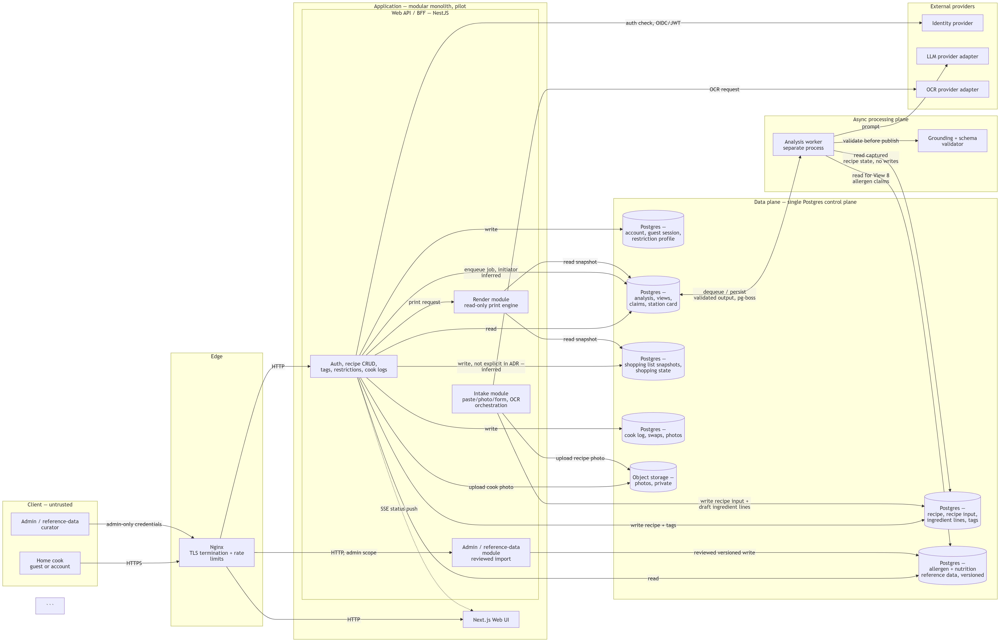

# ADR-001: Recipe Systems Application Architecture

**Status:** v1.3 — Proposed / ready for submission  
**Date:** 2026-09-02  
**Scope:** Defines the runtime architecture for Recipe Systems by translating `Recipe_Systems.md` and `Recipe_Systems_ERD_FINAL.md` into concrete service boundaries, execution flows, ownership rules, and operational decisions.

> **v1.2 revision note:** superseded v1.1's Target Topology diagram, which was written as ASCII art inside a plain text fence and did not render as a diagram in any Markdown previewer. Replaced with an equivalent Mermaid `flowchart` diagram (§10) so it renders visually wherever Mermaid is supported (GitHub, VS Code, Notion, Mermaid Live Editor). No other content changed.
>
> **v1.3 revision note:** the §10 Mermaid `flowchart` is replaced by the rendered topology image `diagram.png`, embedded below (project-lead decision). The trust-boundaries list and all content outside §10 are unchanged. The Mermaid source remains recoverable from git history (commit `736685f`).

---

## 1\. Context: the runtime-architecture gap

`Recipe_Systems.md` defines the product behavior: typed, pasted, or photographed recipe intake; human parse correction; nine fixed analysis views; Home/Chef modes; provenance tags; no-invention behavior; print-first shopping lists and station cards; after-cook logging; dietary warnings; nutrition bands; and a 12-week pilot plan.

`Recipe_Systems_ERD_FINAL.md` defines the persistent model: guest/account ownership, raw intake events, corrected recipe lines, versioned analysis, shopping snapshots, cook history, curated allergen data, and versioned nutrition data.

Together, those documents define **what** the system must support and how the persistent model represents it. This ADR resolves the remaining runtime ambiguities, defines what is canonical, assigns ownership, and specifies how the system executes safely and consistently without changing the ERD.

### 1.1 Runtime questions left open by the source

-   Whether OCR and model generation run synchronously or asynchronously.
    
-   Which component owns each database write.
    
-   How the no-invention rule is enforced for every real recipe, not only in CI.
    
-   How `needs_review` blocks analysis until OCR uncertainty is resolved.
    
-   How guest recipes become account-owned recipes.
    
-   How shopping lists and station cards remain historical, printable snapshots.
    
-   How curated allergen and nutrition data is reviewed and versioned.
    
-   Where the G1 golden-fixture test and G2 regional-review workflow live.
    

### 1.2 Consequences without an architecture decision

1.  An LLM provider failure or latency spike could block the user's request thread.
    
2.  OCR output could reach analysis before the cook has reviewed it, violating B2/B3.
    
3.  Different services could write the same tables, making data ownership and debugging unclear.
    
4.  A model could mention an ingredient that is not in the structured recipe, violating the core no-invention rule.
    
5.  Print output could read live recipe rows instead of immutable snapshot rows, causing printed history to change after an edit.
    
6.  Unreviewed changes to allergen or nutrition reference data could silently affect dietary and nutrition output.
    

---

## 2\. Decision 1 — Modular monolith for the pilot, explicit logical boundaries

**For the 12-week pilot, deploy one modular application plus one separate worker process.** The modules have explicit ownership boundaries even when they share a repository and Postgres instance. Do not begin with five separately deployed microservices; the pilot team and requirements do not justify that operational complexity.

| Concern | Logical owner | Primary write targets |
| --- | --- | --- |
| Authentication, guest sessions, recipe CRUD, tags, restrictions, cook logs | Web API / BFF module | account, guest_session, recipe, recipe_tag, profile tables, cook-log tables |
| Paste/photo/form intake, raw-input persistence, OCR orchestration, parse draft | Intake module | recipe_input, draft recipe_ingredient_line rows, object storage |
| Nine-view generation, provenance, station-card creation | Analysis worker | analysis, analysis_view, analysis_claim, analysis_station_card |
| Shopping-list and station-card PDF/HTML rendering | Render module | Read-only; writes no ERD tables; returns generated output |
| Allergen/nutrition master-data import | Admin/reference-data module | dietary_allergen_definition, dietary_allergen_mapping, nutrition tables |

The Analysis worker is a separate process/container because LLM calls have different latency, failure, retry, and scaling characteristics from ordinary CRUD requests. The other modules may run inside the Web API deployment for the pilot and can be split later without changing the data model or ownership contracts.

### One-writer rule

Every application table has one logical writer:

-   Web API owns account, guest, recipe, tag, restriction, and cook-loop writes.
    
-   Intake owns raw input and OCR-related draft writes.
    
-   Analysis worker owns analysis-family writes.
    
-   Admin/reference-data module owns curated reference-data writes.
    
-   Render module is strictly read-only.
    

A module may read another module's tables, but it must not update them. This makes the source of every mutation unambiguous and prevents split-brain behavior.

---

## 3\. Decision 2 — Single Postgres control plane and object storage

Use the ERD v13 schema in one Postgres database for the pilot. Store original recipe-card images and plate photos in S3-compatible object storage; persist only their URIs in Postgres (`recipe.photo_uri`, `recipe_input.photo_uri`, `cook_log_photo.photo_uri`).

Postgres remains the source of truth for:

-   Account and guest ownership.
    
-   Corrected structured recipes.
    
-   Analysis history and current-analysis selection.
    
-   Shopping-list and station-card snapshots.
    
-   Cook logs and swaps.
    
-   Curated allergen and nutrition reference data.
    

Object storage is the source of truth for binary images; Postgres stores stable references and metadata. No binary image payload is embedded in JSONB or duplicated across analysis rows.

This is intentionally simpler than introducing a separate document database or search engine. The ERD's JSONB fields are product-contract payloads, not a reason to create a second persistence system.

---

## 4\. Decision 3 — Intake is a staged, human-gated pipeline

The intake flow is:

```text
Paste / photo / form
        ↓
Create guest_session or account-owned recipe
        ↓
Persist raw recipe_input
        ↓
OCR photo input when applicable
        ↓
Create draft ingredient lines
        ↓
Mark weak lines needs_review = TRUE
        ↓
Human confirms/corrects the parse
        ↓
Submit the corrected structured object for analysis
```

### Rules

1.  Every paste, photo, or form attempt creates a `recipe_input` row. That row is immutable after creation and preserves what was originally received.
    
2.  Photo inputs are uploaded to object storage and their URI is stored in `recipe_input.photo_uri`; OCR output is stored in `recipe_input.ocr_text`.
    
3.  OCR creates draft `recipe_ingredient_line` rows. Low-confidence lines receive `needs_review = TRUE` and an optional `ocr_confidence` value between 0 and 1. No low-confidence line is silently discarded.
    
4.  Alias matching uses `ingredient_alias` and `ingredient_dictionary`. Ambiguous terms such as "drumstick" are shown for confirmation rather than silently canonicalized.
    
5.  Analysis enqueue is blocked while any active line has `needs_review = TRUE`. The user must confirm or correct every flagged line first.
    
6.  The corrected `recipe` and active `recipe_ingredient_line` rows, not raw OCR or the original text, are the sole input to Analysis.
    

This makes B2 and B3 an actual state transition rather than a visual-only UI convention.

---

## 5\. Decision 4 — Guest and account ownership use one API and one transaction

There is no separate anonymous database or anonymous service. The same Web API and Postgres database serve both guest and authenticated users.

A new intake creates a `guest_session` when no account exists. The associated recipe satisfies the ERD's ownership invariant:

```text
exactly one of recipe.account_id and recipe.guest_session_id is populated
```

When the user creates or signs into an account, claiming occurs transactionally:

```sql
BEGIN;

UPDATE recipe
SET account_id = :account_id,
    guest_session_id = NULL
WHERE guest_session_id = :guest_session_id
  AND account_id IS NULL;

UPDATE guest_session
SET claimed_at = now(),
    claimed_by_account_id = :account_id
WHERE id = :guest_session_id
  AND claimed_at IS NULL;

COMMIT;
```

The claim operation is idempotent and preserves the guest session as an audit record. An account may claim many guest sessions over its lifetime, matching the ERD's `account ||--o{ guest_session` cardinality.

---

## 6\. Decision 5 — Analysis is asynchronous, versioned, and grounded

### Analysis invariant

> **An analysis job captures one immutable structured-recipe state at enqueue time, together with the accepted method, selected mode, and pinned prompt/model versions. The captured state is used exclusively for that analysis execution; the worker never reads later mutable recipe edits while generating the analysis.**

**This analysis-input snapshot is distinct from the persisted shopping-list and station-card snapshots described in Decision 7.** The former is the state captured for one worker execution; the latter are historical output records persisted for printing and later reference.

The persisted `prompt_version` and `model_version` make generation auditable and allow later re-analysis without silently replacing history. The worker must not use another recipe, another user's data, or unversioned mutable prompt configuration while producing an analysis. `analysis.id` is the durable business/job identity; duplicate delivery or retry must converge on the same analysis and must not create duplicate views, claims, or station-card records.

### Execution flow

```text
Confirm parse / request re-analysis
        ↓
Create analysis(status = generating)
        ↓
Capture the structured-recipe state and enqueue the job
        ↓
Analysis worker calls model provider
        ↓
Generate candidate outputs
        ↓
Validate schema and grounding
        ↓
Persist validated outputs transactionally
        ↓
Mark complete/current, or failed/retryable
```

The HTTP request returns after enqueueing. The client receives status through polling or server-push. For the pilot, SSE is the preferred push transport; PostgreSQL remains the durable source of truth and clients reconcile state after reconnect.

### Required rules

-   Exactly one `analysis_view` row exists for each view number 1–9 when generation completes. Views 3 and 7 may be `INCOMPLETE` when the source's refusal rule applies.
    
-   Transient provider/worker failures are retried with bounded backoff. After retry exhaustion, the analysis is marked `failed`; it is never left indefinitely at `generating`.
    
-   Re-analysis creates a new analysis row and points `snapshot_of_analysis_id` to the previous analysis. The previous analysis remains queryable.
    
-   Only one analysis per recipe may be `is_current = TRUE`.
    
-   The worker never updates `recipe` or `recipe_ingredient_line`.
    

### Runtime grounding validator

Before an analysis becomes current, validate every ingredient reference in the nine view payloads and claims against the structured recipe state captured for that job: active ingredient lines, confirmed senses, canonical dictionary entries, and aliases.

-   A referenced ingredient that resolves to a captured recipe line is valid.
    
-   A missing ingredient is valid only when the claim explicitly marks it `ABSENT`, according to the source's rule that absent items may be mentioned only to mark them absent.
    
-   An unresolved positive or neutral ingredient reference is a grounding failure.
    
-   On grounding failure, regenerate once with a correction instruction. If validation still fails, mark the affected view `INCOMPLETE` and record the failure for review. Never publish the ungrounded result as complete/current.
    

The golden fixture remains a CI check; this validator is the production safety boundary.

---

## 7\. Decision 6 — One render engine, snapshot-only reads

Use one rendering module/engine with two templates:

-   Shopping-list template.
    
-   Station-card template.
    

The renderer is read-only and must use only frozen records:

| Output | Permitted source |
| --- | --- |
| Shopping list | shopping_list_generation + shopping_list_item |
| Station card | analysis_station_card for the selected analysis_id |

The renderer must not build a historical print from live `recipe_ingredient_line` rows or mutable current analysis data. It must include the View 8 allergen line, preserve the required disclaimer, and apply the A4/Letter and readability constraints from E4/E5. The implementation technology remains open, but the engine and snapshot-read rule are fixed.

These persisted shopping-list/station-card snapshots are **historical output snapshots**. They are separate from the analysis-input snapshot captured when an Analysis job starts (§6).

---

## 8\. Decision 7 — Reference data uses a reviewed import path

Allergen definitions/mappings and nutrition composition data are curated master data. User requests, model output, and ordinary recipe CRUD cannot write these tables.

The admin/reference-data workflow is:

```text
Prepare CSV/JSON update
        ↓
Show diff against current data
        ↓
Human review and approval
        ↓
Insert new effective-dated version
        ↓
Database constraints reject invalid periods/overlaps
```

The `EXCLUDE USING gist` constraints and effective-period checks from ERD v13 prevent overlapping versions. The application additionally records the source reference and import version. This supports H7/I7 and prevents an unreviewed mapping change from silently changing every recipe's dietary or nutrition output.

---

## 9\. Decision 8 — Quality gates are executable workflows

### G1 golden fixture

Keep the golden fixture outside runtime data:

```text
tests/
  fixtures/
    golden_kanyakumari_card.json
  assertions/
    golden_recipe_assertions.yaml
```

The CI job must exercise the same structured-output schema and grounding rules used by the Analysis worker. It asserts: both fenugreek lines remain; no garlic/ginger is invented; the family is not generic curry; the View 2 coriander blind spot exists; the Chef station card appears when the inferred method is accepted; View 8 never says "safe"; View 9 is a band; sodium remains unknown where required.

### G2 regional veto

Create a reviewer queue for View 5 outputs. A regional reviewer can approve or reject a regional sentence before it is marked publishable for the pilot. Rejected text is stored as a review event outside the canonical recipe and does not mutate the recipe or silently rewrite the analysis; the analysis is regenerated or the affected View 5 is marked incomplete according to the review policy.

The exact review-event table is deliberately not added to ERD v13 because G2 is a governance/pilot workflow rather than one of the source's persisted product objects. If the team needs durable reviewer history beyond the pilot, add a dedicated `analysis_review` table in a later ADR/ERD revision.

---

## 10\. Target topology — pilot runtime and trust boundaries

The pilot deploys one application with explicit logical modules plus one independent Analysis worker. PostgreSQL remains the relational control plane, while object storage, identity, OCR, and LLM providers are external boundaries.



*Rendered topology: untrusted browser → Nginx edge → application zone (Next.js web, NestJS API modules, Analysis worker with grounding + schema validation) → PostgreSQL control plane + private object storage; identity, LLM, and OCR as external trust boundaries.*

### Trust boundaries

1.  Browser → Edge: untrusted client traffic.
    
2.  Edge → Web API: authenticated application traffic; authorization is checked server-side.
    
3.  Web API/Worker → PostgreSQL: private server-side access; credentials never reach the browser.
    
4.  Web API/Worker → object storage: private service access; clients receive authorized short-lived access only.
    
5.  Worker → external AI providers: minimum required recipe state only; provider/model identity is recorded.
    
6.  Admin/reference-data workflow → curated data: privileged write boundary.
    

---

## 11\. Architectural reconciliation matrix

| Topic | Ambiguity | Decision |
| --- | --- | --- |
| Analysis execution | Synchronous or asynchronous | Asynchronous Analysis worker |
| Analysis input | Mutable live recipe or fixed state | Capture structured-recipe state at job creation |
| OCR review | UI-only flag or hard gate | needs_review blocks Analysis until resolved |
| Guest ownership | Guest recipe requires account or not | Guest session owns recipe before account creation |
| Ownership after claim | Replace guest history or preserve it | Transactional claim; guest session retained |
| Analysis history | Replace prior analysis or version it | New Analysis row; predecessor retained |
| Current analysis | Multiple current versions possible | At most one current per recipe |
| Printing | Rebuild from live rows or preserve output | Render from persisted historical snapshots only |
| Allergen mapping | Global mapping vs per-analysis result | Curated mapping is reference data; analysis claims store recipe-specific result |
| Reference versions | Destructive updates or version history | Reviewed effective-dated versions |
| G1 | Runtime entity or test infrastructure | CI fixture/assertions only |
| G2 | Required runtime entity or pilot governance | External/admin workflow for pilot |
| Analysis tags | Separate entity or claim vocabulary | Current interpretation uses analysis_claim.claim_tag; separate tags remain open |
| I3 portions | Persistence location unspecified | Explicit open decision |
| Queue | Dedicated broker or existing control plane | PostgreSQL-backed queue for pilot |
| Realtime | Polling, WebSocket, or SSE | SSE preferred; database state remains authoritative |

---

## 12\. Canonical domain vocabulary

| Term | Canonical meaning |
| --- | --- |
| Account | Authenticated application identity and ownership context |
| Guest Session | Temporary unauthenticated ownership context that may later be claimed |
| Recipe | Canonical structured recipe |
| Recipe Input | Immutable record of originally submitted text/photo/form input |
| Ingredient Line | One distinct ingredient occurrence in a recipe |
| Ingredient Dictionary | Canonical ingredient identity/reference |
| Ingredient Alias | Alternate or vernacular wording for canonicalization |
| Analysis | Versioned analysis generated from a captured recipe state |
| Analysis View | One of the nine fixed product views |
| Analysis Claim | Provenance-bearing statement attached to an analysis view |
| Station Card | Chef-mode operational artifact |
| Shopping List Generation | Point-in-time shopping output snapshot |
| Shopping List Item | Historical item in a shopping-list snapshot |
| Shopping State | Persistent current have/need state for a recipe-specific shopping identity |
| Cook Log | Historical cooking-session record |
| Cook Log Swap | Historical ingredient/quantity change |
| Allergen Definition | Canonical allergen identity |
| Allergen Mapping | Curated versioned ingredient↔allergen relationship |
| Food Composition Entry | Curated nutrition source mapping |
| Home Mode | Explanatory presentation mode |
| Chef Mode | Concise operational presentation mode |

### Vocabulary rules

-   Raw input is not canonical recipe truth.
    
-   Corrected `recipe` + active `recipe_ingredient_line` rows are canonical recipe truth.
    
-   Analysis output does not automatically rewrite recipe truth.
    
-   Historical snapshots are frozen output records.
    
-   Current state remains mutable.
    

---

## 13\. Architectural invariants

| ID | Mandatory invariant |
| --- | --- |
| INV-01 | Corrected structured recipe is the canonical recipe source of truth. |
| INV-02 | Exactly one of recipe.account_id / recipe.guest_session_id is populated. |
| INV-03 | Every application table has one logical writer. |
| INV-04 | Low-confidence OCR lines are never silently discarded. |
| INV-05 | Active needs_review lines block Analysis enqueue. |
| INV-06 | An Analysis job uses only the structured-recipe state captured for that job. |
| INV-07 | Analysis worker never mutates recipe or recipe_ingredient_line. |
| INV-08 | A completed Analysis has one view for each 1..9; refusal cases are represented as INCOMPLETE. |
| INV-09 | At most one Analysis per recipe is current. |
| INV-10 | Failed or ungrounded Analysis cannot become current. |
| INV-11 | Worker retries are idempotent and cannot create duplicate business artifacts. |
| INV-12 | Historical shopping/station-card output does not reconstruct from mutable live recipe rows. |
| INV-13 | View 8 is never a safety certificate. |
| INV-14 | View 9 is an estimate/band, not false precision. |
| INV-15 | Curated allergen/nutrition reference data changes only through reviewed workflows. |
| INV-16 | LISTEN/NOTIFY is a delivery signal, not durable state. |
| INV-17 | Ownership and authorization are checked before recipe/account/guest data access. |
| INV-18 | Secrets and sensitive personal data never enter application logs. |

---

## 14\. Job idempotency, retry, and dead-letter policy

### Idempotency

-   `analysis.id` is the business/job identity.
    
-   Duplicate delivery must converge on the same Analysis record.
    
-   View, claim, and station-card creation must use uniqueness constraints and/or idempotent upserts.
    
-   External provider retries are repeatable attempts, not assumed single execution.
    

### Retry lifecycle

```text
queued
  ↓
processing
  ↓
transient failure
  ↓
bounded retry + backoff
  ↓
success
     OR
retry exhausted
  ↓
failed
```

Permanent configuration, validation, authorization, and unsupported-output errors must not retry indefinitely.

### Manual replay

A permanently failed job retains diagnostic identity. Manual replay must preserve the failed record and must not silently overwrite a successful historical Analysis.

---

## 15\. Transaction and concurrency boundaries

### Guest claim

Ownership transfer and guest-session claim occur in one transaction and are safe to retry.

### Analysis creation

The service validates the recipe version/state, creates the Analysis identity, captures the input state, enqueues the job, and commits a recoverable state transition.

### Analysis publication

Candidate output is validated before publication. Only validated output can become complete/current; the current-analysis transition occurs atomically with validated output publication.

### Concurrent recipe edit

If the recipe changes after capture:

```text
Analysis A → captured recipe state A
Recipe edit → current recipe state B
```

Analysis A remains based on A. A later Analysis may use B.

Stale writes are rejected using the recipe's version/timestamp concurrency control.

---

## 16\. Data lifecycle, retention, and deletion

| Data | Lifecycle principle |
| --- | --- |
| Recipe | Current canonical state; D6 deletion behavior applies |
| Recipe Input | Immutable source record, retained according to privacy/product policy |
| Recipe photos | Private object-storage objects tied to retention/deletion policy |
| Analysis | Historical/versioned artifact; not silently replaced |
| Shopping/station-card snapshots | Historical outputs retained according to product history/print policy |
| Cook logs/photos | Private historical user data |
| Guest session | Expires after configured TTL |
| Reference data | Versioned history; no destructive overwrite of active versions |
| Logs | Short operational retention with redaction |
| Failed/dead-letter jobs | Retained for investigation/replay, then expired by policy |

Cleanup operations must be safe to retry. Private uploaded objects must not remain indefinitely after their owning data is deleted.

---

## 17\. Disaster recovery and operational durability

### PostgreSQL

Production database hosting should provide: automated backups, point-in-time recovery, encrypted storage, encrypted connections, capacity monitoring, and documented restoration.

### Object storage

User photos require: durable storage, private access, lifecycle policy, and provider-appropriate recovery/versioning policy.

### Recovery objectives

The team must establish:

-   **RPO** — maximum acceptable data loss window.
    
-   **RTO** — maximum acceptable recovery time.
    

Exact numbers are deliberately not invented in this ADR.

### Restore validation

Periodically test:

```text
Backup
  ↓
Restore
  ↓
Schema/data validation
  ↓
Application connectivity
  ↓
Sample recipe/photo retrieval
```

A backup is not considered operationally verified until restoration is tested.

---

## 18\. Capacity, scaling, and cost controls

| Component | Pilot | Primary scale signal |
| --- | --- | --- |
| Next.js | 1 container | page latency / CPU |
| Web API | 1 container, horizontally scalable | request latency / CPU |
| Analysis worker | 1+, independently scalable | queue depth / job latency |
| PostgreSQL | Managed | CPU / I/O / connections / storage |
| Object storage | Managed | object/request volume |
| Render | Shared application process initially | render latency / CPU |
| SSE | API-managed | concurrent connections |
| AI providers | External | quota / latency / spend |

### Cost controls

Implement: maximum input and photo size, Analysis request rate limits, bounded retry count, provider timeouts, model/token budgets where supported, and duplicate-request protection.

AI/OCR spend must remain bounded even during abusive or accidental repeated requests.

---

## 19\. Authentication and API boundary

### Authentication

Identity authentication is handled by the selected identity provider. The application owns application-specific authorization and recipe ownership.

### API

The browser communicates with the Web API/BFF. The browser never directly accesses PostgreSQL, queue storage, administrative reference-data tables, or privileged object-storage credentials.

### Worker

The Analysis worker receives only the captured recipe state and job metadata required for execution and writes only Analysis-family tables.

### Provider adapters

LLM/OCR providers are called through provider-neutral interfaces. Vendor-specific responses are normalized before entering the canonical application model.

---

## 20\. Security and privacy rules

-   Every recipe/account/guest-session request is authorized by ownership before data is returned or modified.
    
-   Guest session identifiers are unguessable UUIDs and are subject to expiry cleanup.
    
-   A guest recipe is never exposed to another guest session.
    
-   Analysis workers receive only the minimum structured-recipe state required for the job.
    
-   Original photos and plate photos are private object-storage objects; serve them through authorized, expiring access URLs.
    
-   Cook logs and notes are private to the owning account.
    
-   User-provided text is treated as untrusted input; it must not override grounding or authorization rules.
    
-   Reference-data import credentials are admin-only and separate from normal user-service credentials.
    

---

## 21\. Failure handling and observability

| Failure | Required behavior |
| --- | --- |
| OCR provider timeout | Keep recipe_input; mark intake retryable; do not discard the uploaded photo |
| LLM timeout/provider failure | Mark analysis.status = failed; expose retry; preserve previous current analysis |
| Grounding failure | Do not publish current; retry with correction or mark affected view incomplete |
| Print-render failure | Return retryable error; leave source snapshots unchanged |
| Guest-session expiry | Scheduled cleanup removes expired unclaimed guest aggregate according to retention policy |
| Reference-data import conflict | Reject transaction; show conflicting effective period; preserve current reference data |
| Concurrent recipe edit | Reject stale updated_at/version and require reload/merge |

At minimum, log correlation ID, recipe ID, analysis ID, input ID, provider/model version, duration, status, and failure category. Never log private recipe photos, full cook notes, credentials, or unrestricted raw personal data.

---

## 22\. Delivery impact

| Source area | Architecture consequence |
| --- | --- |
| A2 guest session | Web API creates guest ownership and claims it transactionally |
| B2/B3 intake | Intake persists raw input, flags weak OCR lines, and blocks Analysis until review |
| C1–C6 analysis | Async worker generates versioned views, claims, and station card using captured input state and grounding validation |
| D5 re-analysis | New Analysis row + predecessor link; previous Analysis remains intact |
| E1–E5 shopping/print | One read-only render engine reads persisted output snapshots only |
| F1–F6 cook loop | Web API owns logs/swaps/photos; historical records are preserved |
| G1/G2 quality | CI harness and regional-review queue become explicit workflows |
| H7/I7 references | Admin-only reviewed, versioned import path |

No ERD V13 table changes are required by this ADR. The architecture adds runtime ownership, workflow, reliability, and operational rules around the approved data model.

---

## 23\. Final submission cross-check

| Check | Result |
| --- | --- |
| Requirements → architecture traceability | ✅ |
| ERD V13 → architecture alignment | ✅ |
| Logical ownership | ✅ |
| One-writer rule | ✅ |
| Target topology (embedded diagram.png) | ✅ |
| Trust boundaries | ✅ |
| Canonical vocabulary | ✅ |
| Architectural invariants | ✅ |
| Idempotency/retry policy | ✅ |
| Transaction/concurrency model | ✅ |
| Data lifecycle | ✅ |
| Disaster recovery | ✅ |
| Capacity/scaling | ✅ |
| Cost controls | ✅ |
| Authentication/API boundary | ✅ |
| AI/OCR provider boundaries | ✅ |
| G1/G2 treatment | ✅ |
| Open decisions explicitly identified | ✅ |
| ERD changed by ADR | ❌ No |

---

## 24\. Open decisions and ADR conclusion

### Open decisions

1.  LLM provider/model after representative quality, grounding, latency, and cost evaluation.
    
2.  OCR provider after real recipe-card benchmarking.
    
3.  Exact queue library/configuration.
    
4.  Print engine implementation details.
    
5.  Object-storage provider and retention configuration.
    
6.  Identity provider and required SSO/MFA configuration.
    
7.  Guest-session TTL.
    
8.  I3 portion-count persistence location.
    
9.  Independent `Analysis.tags` interpretation.
    
10.  Durable G2 reviewer-history requirement.
     
11.  Exact RPO/RTO.
     
12.  Exact retry counts/backoff values.
     

### Conclusion

Recipe Systems will run as a modular monolith for the pilot with a separate asynchronous Analysis worker, one PostgreSQL control plane, private object storage, explicit one-writer ownership, human-gated intake, captured analysis input state, runtime grounding validation, snapshot-only historical rendering, reviewed reference-data imports, and explicit reliability/security controls.

The architecture resolves the principal runtime ambiguities between the requirements and ERD without changing the approved ERD. It preserves the core product invariants: corrected structured recipe data remains canonical; low-confidence OCR is flagged rather than dropped; guest recipes can become account-owned; analysis history is retained; distinct ingredient lines remain distinct; shopping and print artifacts remain historical snapshots; the Analysis worker uses only its captured recipe state; View 8 cannot become a safety certificate; View 9 remains a band; and model output cannot silently invent recipe ingredients.

This ADR is the runtime contract between `Recipe_Systems.md`, `Recipe_Systems_ERD_FINAL.md`, and the technology implementation. Vendor selections belong in the technology-stack document; product/operational decisions still open are explicitly listed rather than silently assumed.
