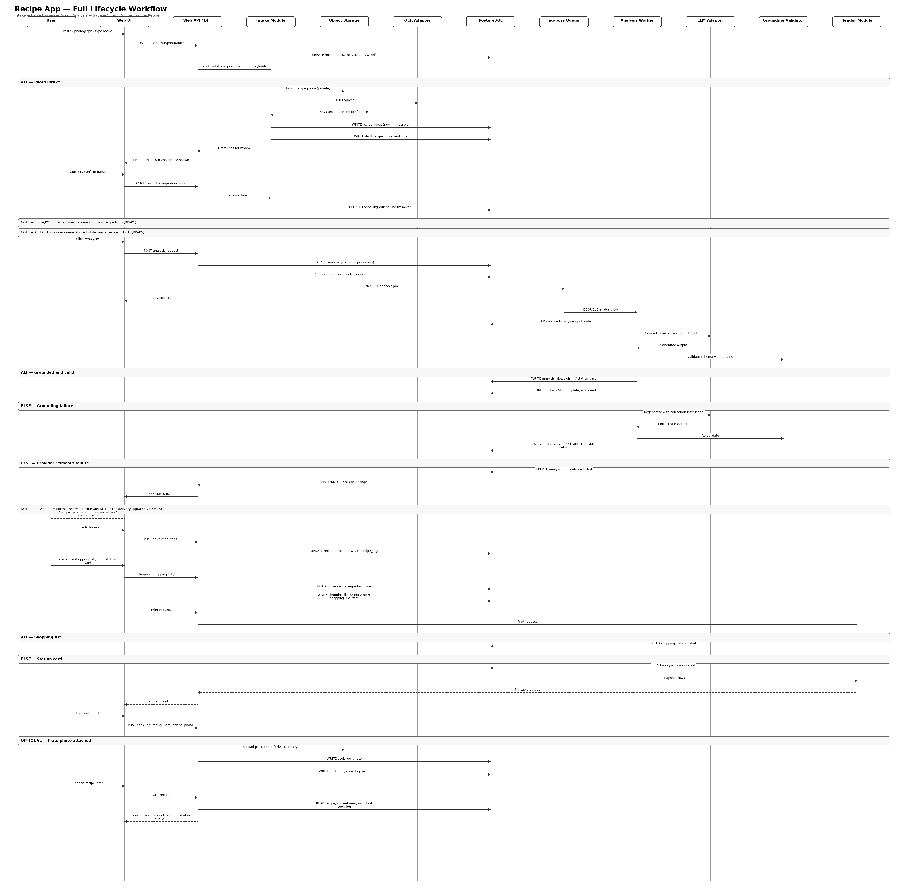

# Recipe Systems — Workflow Connectivity Analysis

> Aligned with ADR-001 v1.3 (`Recipe_Systems_Architecture_Decision_FINAL_V5.md`) and the dispatch program v1.1 (DISPATCH/AUDIT/HANDOFF).

**Status:** v1.0 · 2026-09-04
**Purpose:** Verify that all 50 user stories connect properly and that data flows correctly between entities — across the full architecture: browser → edge → Next.js web / NestJS API (BFF) → Analysis worker → PostgreSQL control plane / private object storage → external providers (identity, LLM, OCR), per ADR-001 §10.
**Sources:** `Recipe_Systems.md` · `Recipe_Systems_ERD_FINAL.md` v13 · `Recipe_Systems_Architecture_Decision_FINAL_V5.md` · `Recipe_Systems_Tech_Stack_FINAL.md` · `USER_STORIES.md` · `SCAFFOLD.md` · `BUILD_PLAN.md` · `TEST_PLAN.md` · `DISPATCH.md` · `AUDIT.md` · `HANDOFF.md`
**Rules honored:** no architecture invented (source-silent hops are labeled); Q1–Q17 remain OPEN; Keycloak remains the Q8 working assumption only; the workflow PNG is the existing asset, referenced as-is and never modified.

---

## 1. Entity hierarchy (canonical — ERD v13 vocabulary)

The domain is one cook (account **or** guest session) who owns recipes built from raw intake, analysed into nine views, saved, shopped, printed, and logged after cooking. Reference data is curated, versioned, and admin-written only.

```
COOK
 ├── account                      (optional at first — A2 guest path)
 │     ├── account_restriction_profile → account_restriction_item   (H1/H3)
 │     └── preferred_mode, label_pack
 ├── guest_session                (anonymous; expires; claimable onto an account — A2, Q11)
 └── recipe                       (the corrected object — source of truth; owner = account XOR guest, INV-02)
       ├── recipe_input           (immutable raw event: paste/photo/form — C-41; ocr_text)
       ├── recipe_ingredient_line (draft → corrected; needs_review, ocr_confidence, shopping_key)
       │     └── ingredient_shopping_state   (composite FK recipe_id + shopping_key — ERD §7)
       ├── method                 (method_text, method_source_tag, method_inferred_source — B4)
       ├── recipe_tag             (D3)
       ├── analysis               (is_current; snapshot_of_analysis_id chain — D5; prompt_version)
       │     ├── analysis_view 1..9            (each may be INCOMPLETE — C2)
       │     ├── analysis_claim                 (claim_tag ∈ CARD|METHOD|INFERRED|ABSENT|UNKNOWN|ASSUMED — C4)
       │     └── analysis_station_card          (C5)
       ├── shopping_list_generation → shopping_list_item    (E1)
       └── cook_log                (+ cook_log_swap — F3; cook_log_photo — F5)
 └── reference data (admin module is the sole writer — one-writer rule, ADR §2):
       dietary_allergen_definition → dietary_allergen_mapping            (H2/H7)
       nutrition_food_composition_entry / version                        (I1/I7)
       ingredient_dictionary → ingredient_alias (requires_confirmation)  (B6 — writer per Q5 working assumption)
```

| Entity | Belongs to | Store (ERD §) | Notes |
|---|---|---|---|
| `account` | cook (person) | §5 | `preferred_mode` (home default), `label_pack` US/EU |
| `guest_session` | anonymous cook | §5 | unguessable UUID; expiry cleanup (TTL = Q11 pilot default) |
| `recipe` | account XOR guest (INV-02) | §5 | the corrected object — what analysis, lists, and prints read |
| `recipe_input` | recipe | §5 | immutable raw event (C-41); no UPDATE path |
| `recipe_ingredient_line` | recipe | §5 | draft lines; `needs_review` blocks analysis (INV-05) |
| `ingredient_shopping_state` | line (recipe_id, shopping_key) | §7 | survives list regeneration and line soft-delete (C-28) |
| `analysis` + views/claims/station card | recipe | §6 | one `is_current` per recipe; snapshots chain (D5) |
| `cook_log` (+swap/photo) | recipe | §8 | after-cook capture; never rewrites the card |
| `dietary_allergen_*` / `nutrition_food_composition_*` | platform reference | §9/§10 | effective-dated, overlap-protected (`EXCLUDE USING gist`), reviewed import (ADR §7) |
| `ingredient_dictionary` / `ingredient_alias` | platform reference | §5 | writer per Q5 working assumption (admin module) |

---

## 2. End-to-end workflow — the diagram

### Runtime topology (ADR-001 §10, embedded `diagram.png`)

Untrusted browser → Nginx edge (TLS termination, rate limits) → application zone (Next.js Web UI, NestJS API modules, Analysis worker with grounding + schema validation) → PostgreSQL control plane + private object storage; **identity, LLM, and OCR as external trust boundaries**. The API ↔ worker path is indirect: the worker dequeues pg-boss jobs from Postgres (Tech Stack §9) and progress flows worker → Postgres `NOTIFY` → API → SSE → browser (Tech Stack §13). There is no direct HTTP between API and worker (SCAFFOLD §3).

### End-to-end workflow diagram (existing asset, referenced as-is)



*The existing `recipe_app_workflow_diagram_v2_fixed.png` (v2 fixed) — the app-level workflow asset, embedded exactly as provided, never modified or recreated. Its standing policy remains **Q17 (OPEN)**; this embedding is a user-directed usage of the asset, not a policy decision.*

### The path one recipe takes, end to end (grounded in the §15 acceptance scene)

1. **Enter** — a cook arrives either signed in (`account`, A1) or anonymously (`guest_session`, A2). Ownership of every recipe is checked on every read/write (INV-17, ADR §20).
2. **Intake** — paste (B1), photograph (B2), or structured form (B5) → an immutable `recipe_input` raw row; photos go to private object storage, URI only (ADR §3).
3. **OCR draft** — OCR adapter output lands as draft lines; low-confidence lines flagged `needs_review = TRUE`, never dropped (INV-04, B2).
4. **Parse review** — edit/add/delete/split/merge, mark headers (B3) → the corrected object; the raw input stays untouched.
5. **Method** — optional; matched family method accepted as INFERRED with named source, else list-only → Views 3/7 INCOMPLETE (B4, §3.4).
6. **Enqueue gate** — analysis refuses to enqueue while any active line has `needs_review = TRUE` (INV-05).
7. **Analysis** — worker picks the pg-boss job (idempotent, INV-11), runs the view prompts (frozen nine-view schemas from P0; `prompt_version` persisted) through the provider-neutral LLM adapter (Q9), then the grounding validator (INV-10, ADR §6) — every claim must reference a captured line or be marked ABSENT; regenerate once, else the view is INCOMPLETE.
8. **Nine views** — Views 1–9 render from `analysis_*` rows; home mode is the default; chef mode toggles to the station-card-led presentation (C3/C5); View 8/9 disclaimers (H6/I6) on every surface.
9. **Save** — the full artifact set persists (D1); the library lists name/date/family/cook-log indicator (D2).
10. **Shop** — the shopping list is generated from the structured object only (E1); have/need state persists (E2); market grouping (E3).
11. **Print** — shopping list and station card render from persisted snapshots only (INV-12) via the Playwright templates (E4/E5), allergen line per Q2.
12. **Cook** — log + rating + note (F1/F2); next-time line and last-cook recall surface on reopen (F6); garlic still absent.

---

## 3. Access & ownership boundaries

The sources define **ownership, not role tiers** — this is the Recipe analog of a role matrix, drawn only from what exists:

| Actor | Scope | Source |
|---|---|---|
| Guest session | recipes it created, until expiry or claim | SCAFFOLD §3, ADR §20 |
| Account holder | own recipes, library, logs; `preferred_mode` | ADR §19/§20 |
| Regional reviewers (2, on contract) | veto live View 5 regional sentences (G2) | Recipe_Systems §12 G2, §13 |
| Admin/reference-data module | sole writer of dietary/nutrition reference tables (+ dictionary/alias per Q5 assumption) | ADR §2, BUILD_PLAN Track R |
| IdP (Q8 working assumption) | credential lifecycle, reset, email verification, OAuth/SSO, MFA — never application authorization | Tech Stack §14, ADR §19 |

**One-writer boundaries (binding, ADR §2 + SCAFFOLD §2):**

| Table family | Sole writer | Consumers (read-only) |
|---|---|---|
| `analysis_*` | Analysis worker | API (presents), web (renders) |
| `dietary_*`, `nutrition_*` | Admin/reference-data module | View 8/9 via joins |
| `ingredient_dictionary`, `ingredient_alias` | admin module (Q5 working assumption) | P2 sense confirmation (B6) |
| `recipe_input` | intake only; never updated afterwards (C-41) | everything reads |
| all Postgres DDL | Prisma migrations (SCAFFOLD §2) | — |
| `packages/rendering` | read-only renderer — no DB writes (ADR §7) | print paths |

---

## 4. Story-connectivity mapping — which story owns each hop

| Hop | Stories | Dispatch unit | Notes |
|---|---|---|---|
| Sign up / sign in (cookies) | A1 | D-07 | OIDC → HTTP-only cookie session (Tech Stack §14) |
| Anonymous session + claim | A2 | D-08 | claim transaction; guest row preserved as audit |
| Ownership check on every read/write | A1, A2 (INV-17) | D-09 | XOR invariant INV-02 |
| Paste intake | B1 | D-10 | mixed units, "to taste", vernacular names |
| Photo intake + object storage | B2 | D-10 | URI only; no blob in Postgres |
| Form intake | B5 | D-10 | same corrected object shape |
| OCR draft + low-confidence flagging | B2 (INV-04) | D-11 | flagged, never dropped |
| Parse review (edit/split/merge/headers) | B3 | D-12 | corrected object is what analysis reads |
| Method attach | B4 | D-13 | INFERRED with named source |
| Enqueue gate | — (INV-05) | D-14 | infrastructure invariant; no story owns it |
| Worker job execution | — | D-17 | infrastructure (pg-boss, idempotency INV-11) |
| Prompts + schema validation | C2 (inputs) | D-15 | frozen schemas; `prompt_version` |
| Grounding / no-invention | C2 (INV-10) | D-16 | regenerate once → INCOMPLETE |
| Identification | C1 | D-18 | family/architecture/confidence/neighbours/ABSENT |
| Views 1–4 | C2 | D-18 | home mode first |
| Views 5–9 | C2 | D-19 | incl. View 8/9 against reference data |
| Claim tags + disagreements | C4 | D-18 | six canonical tags; UNKNOWN stays blank |
| Home ↔ chef toggle | C3 | D-20 | `account.preferred_mode` |
| Station card | C5 | D-20 | method or accepted-inferred precondition |
| View 8/9 disclaimers | H6, I6 | D-19, D-21 | verbatim on every surface |
| Save / browse / delete | D1, D2, D6 | D-22 | hard DELETE cascade; no residue |
| Edit → parse review, re-analyse on request | D4, C6 | D-25 | snapshot chain (D5) |
| Analysis snapshot | D5 | D-25 | logs keep pointing at their analysis |
| Tags + search | D3 | D-25 | name / ingredients / tags |
| Alias resolution | B6 | D-25 | five source groups; "drumstick" confirmation |
| Substitution preview | C7 | D-25 | structural / modular / identity-shift; conditional (§13) |
| Shopping list generation | E1 | D-30 | structured object only; two fenugreek rows |
| Have/need state | E2 | D-30 | persists; survives regeneration |
| Market grouping | E3 | D-30 | five source categories |
| Print list / station card | E4, E5 | D-23 | snapshot-only (INV-12); one page each |
| Allergen line on prints | H4 | D-23 | mechanism per Q2 |
| Cook log / rating / note | F1, F2 | D-24 | private; above the analysis on reopen |
| Reopen recall | F6 | D-24 | next-time line at the top |
| Swaps recorded | F3 | D-26 | card unchanged unless applied |
| Next-time field | F4 | D-26 | tagged COOK LOG on the card, never CARD |
| Restriction profile + highlighting | H1, H3 | D-26 | unknown ≠ pass; no auto-delete |
| Restriction-driven swap | H5 | D-26 | reuses F3 |
| Portions / tighten band | I3, I4 | D-26 | I3 per-bowl only after portions set (Q14) |
| Reference data import (allergen/nutrition/dictionary) | H7, I7 | D-29 | reviewed path, effective-dated |
| Regional veto | G2 | D-27 | blocks live View 5 sentences |
| Golden fixture in CI | G1 | D-03 | 8 invariants, runs every phase |
| Chef pass | G3 | D-28 | week-12 gate |
| One-pager / plate photo / energy band | E6, F5, I5 | D-31 | conditional — only if Must on weeks 9–10 is stable (§13) |
| App shell / browse entry | — | D-01 (skeleton) | source-silent; no story owns the shell |
| Nginx edge (TLS, rate limits) | — | D-01 | infrastructure; no story (ADR §10) |
| SSE status push | — | D-17 | infrastructure (Tech Stack §13; INV-16) |
| IdP internals | — | D-06 | Q8 working assumption; no story (Tech Stack §14) |

---

## 5. Detailed workflows

### Workflow 1 — Guest, account, claim (A1, A2)

```
1. Cook opens the app → guest session created (unguessable UUID)          [A2 · D-08]
2. Guest ingests and sees analysis                                        [A2 TC-01]
3. Cook saves while signed out → sign-in prompted                         [A1 TC-02 · D-07 seam]
4. Sign-up → account created (preferred_mode = home, label_pack US/EU)    [A1 · D-07]
5. Claim transaction: recipe moves to the account, idempotent;            [A2 · D-08]
   guest row preserved as audit; chk_recipe_owner_xor holds (INV-02)
6. Expired unclaimed guests cleaned up (TTL = Q11 pilot default)          [D-08 · QG4 cell]
```

### Workflow 2 — Intake, OCR, review, method (B1, B2, B3, B4, B5)

```
1. Paste | photo | form → immutable recipe_input row; photo → object      [B1/B2/B5 · D-10]
   storage (URI only); upload failure → no URI persisted (QG4 cell)
2. OCR adapter (provider-neutral; Q10) → ocr_text on draft lines;         [B2 · D-11]
   low confidence → needs_review = TRUE, never dropped (INV-04)
3. Parse review: edit/add/delete/split/merge, mark headers;               [B3 · D-12]
   corrected object is what analysis reads; raw input untouched
4. Method optional: entered, or matched family method accepted            [B4 · D-13]
   (INFERRED + named source); list-only → Views 3/7 INCOMPLETE (§3.4)
5. Enqueue gate: blocked while any active line needs_review (INV-05)      [D-14]
6. Stale concurrent edit rejected on version/updated_at, reload/merge     [D-12 · QG4 cell]
```

### Workflow 3 — Analysis, grounding, nine views, modes (C1, C2, C4, C3, C5)

```
1. Worker dequeues pg-boss job (idempotent; duplicates converge — INV-11) [D-17]
2. View prompts + home/chef system prompts, validated against the         [D-15]
   frozen P0 schemas; prompt_version persisted per analysis
3. LLM adapter (provider-neutral; provider = Q9, mocked in CI)            [D-15]
4. Grounding validator: claims must resolve against captured lines        [D-16]
   or be ABSENT; regenerate once; else view INCOMPLETE — never current (INV-10)
5. analysis_* rows written by the worker alone (one-writer)               [D-17]
6. Progress: worker → NOTIFY → API → SSE → browser (INV-16: signal,       [D-17]
   never durable state); reconnect-and-reload reconciles from Postgres
7. Views 1–4 render (identification C1; claims tagged C4;                 [D-18]
   disagreement module shows the coriander case; UNKNOWN stays blank)
8. Views 5–9 render (View 8 via analysis_claim.allergen_id against        [D-19]
   dietary tables; View 9 bands from nutrition tables; I2 assumption edit
   recomputes; disclaimers H6/I6)
9. Home default; chef toggle → station card leads (C3)                    [D-20]
10. Station card generated only when method exists or inferred accepted   [D-20]
    (mise, sequence, do-nots, control points)
```

### Workflow 4 — Save, library, edit, re-analyse (D1, D2, D6, D4, D5, C6, D3)

```
1. Save: raw input, photo, object, identification, analysis (or           [D1 · D-22]
   regenerate capability), timestamps; default name = family
2. Library: name, date, family, cook-log indicator                        [D2 · D-22]
3. Edit → parse review; re-analyse only on request (C6)                   [D4 · D-25]
4. Re-analyse: previous analysis snapshotted, linked to existing logs     [D5 · D-25]
   (last + current is enough for the pilot); cook notes never overwritten
5. Tags + search (name/ingredients/tags)                                  [D3 · D-25]
6. Delete: confirm → hard DELETE cascade (photo, object, analyses,        [D6 · D-22]
   lists, logs); no residue anywhere
```

### Workflow 5 — Shop and print (E1, E2, E3, E4, E5, H4)

```
1. List generated from the structured object only; one row per            [E1 · D-30]
   ingredient; "to taste"/"for tempering" visible; two fenugreek rows;
   no headers
2. Have/need ticked → ingredient_shopping_state (composite FK)            [E2 · D-30]
3. Grouping: fresh produce, fish/meat, spices, fats/oils, other           [E3 · D-30]
4. Print via Playwright templates from persisted snapshots only           [E4/E5 · D-23]
   (INV-12 — prints do not change after a later edit)
5. List: black text, recipe name, date, grouped rows, checkboxes,         [E4 · D-23]
   one page, no account chrome, allergen line (H4 — mechanism per Q2)
6. Station card: separate document; control points + "untasted            [E5 · D-23]
   briefing"; arm's-length readable; allergen line (H4)
7. PDF failure → retryable error; snapshots unchanged (QG4 cell)          [D-23]
```

### Workflow 6 — Cook loop (F1, F2, F6, F3, F4, F5)

```
1. Log cook: cooked_at defaults today, editable; multiple logs            [F1 · D-24]
2. Rating 1–5 optional + free-text note; private                          [F2 · D-24]
3. Swaps: skipped/reduced/increased/swapped recorded; card unchanged      [F3 · D-26]
   unless the swap is applied (restriction-driven swaps reuse it — H5)
4. Next-time instruction in its dedicated field                           [F4 · D-26]
5. Reopen: last cooked, rating, next-time line at the top (above the      [F6 · D-24]
   analysis); shopping list still reflects the saved card unless a swap
   was applied
6. Plate photo: one image per log; not re-analysed unless asked           [F5 · D-31 — conditional]
```

### Workflow 7 — Dietary & nutrition (H1, H2, H3, H4, H5, H6, H7, I1, I2, I3, I4, I5, I6, I7)

```
1. Track R reviewed import: CSV/JSON → diff → human approval →            [H7/I7 · D-29]
   effective-dated version; EXCLUDE USING gist rejects overlaps
2. View 8 on every analysis: golden mapping (fish + mustard flagged;      [H2 · D-19]
   coconut NOT filed as US major tree nut); conflicts-first against
   profiles (H3 — unknown is not a pass)
3. View 9 as a band (pot scale), sodium Unknown; assumption editors       [I1/I2 · D-19]
   (fish class, coconut grams, oil tablespoons) recompute; unmapped
   lines excluded from totals and listed (I7)
4. Disclaimers verbatim on every surface (H6/I6)                          [D-19, D-21]
5. Portions → per-bowl band only after portions set (I3; Q14 seam)        [I3 · D-26]
6. Tighten: name fish / weigh coconut / measure oil (I4)                  [I4 · D-26]
7. One-pager: keep/negotiate/identity-shift + optional energy band        [E6/I5 · D-31 — conditional]
```

### Workflow 8 — Quality & review (G1, G2, G3)

```
1. Golden fixture scaffolded in CI (D-03); 8 invariants asserted on       [G1 · D-03 + every phase]
   every PR — garlic must never appear; two fenugreeks must not merge;
   View 9 never prints a point-kcal (§3.8)
2. Week-4 adversarial: chef lie-circling on ingest                        [TEST_PLAN §5 · D-28 context]
3. Week-8 adversarial: three-curry separation                             [TEST_PLAN §5]
4. Regional veto: reviewers block live View 5 sentences (wk 11)           [G2 · D-27]
5. Week-12 chef pass on Kumari / inland Tamil / Kerala kudampuli          [G3 · D-28]
   (identification differs, zero invented ingredients, runnable cards,
   no "safe", no point-kcal as fact)
```

---

## 6. Error / fallback paths (only what the sources document)

| Failure | Behavior (documented) | Source | Owning phase |
|---|---|---|---|
| OCR provider down/timeout | `recipe_input` + photo preserved; intake retryable | Tech Stack §21 | P2 (QG4 cell) |
| OCR low confidence | `needs_review = TRUE`; analysis blocked; never dropped | INV-04/INV-05 | P2 |
| LLM provider down/timeout | `analysis.status = failed`, retryable; previous current preserved | Tech Stack §21, QG4 | P3 |
| LLM output invalid schema | reject/regenerate; never publish | Tech Stack §21 | P3 |
| Grounding failure | not current (INV-10); regenerate once → INCOMPLETE | ADR §6 | P3 |
| Worker crash / duplicate job | idempotent retry; converge on one analysis | INV-11, ADR §14 | P3 |
| NOTIFY/SSE signal lost | reconnect + reload from Postgres | Tech Stack §13, INV-16 | P3 |
| Postgres down during request | controlled failure; no partial business state | Tech Stack §21 | P1 (named test) |
| Object-storage upload failure | no URI persisted for a missing object | QG4 | P2/P6 |
| Reference import overlap | reject transaction; current data preserved | ADR §7 | Track R |
| Concurrent stale edit | reject on version/`updated_at`; reload/merge | ERD §13 | P2 (re-asserted P7) |
| PDF render failure | retryable error; snapshots unchanged | QG4 | P5 |
| IdP down | 503 envelope; no unauthenticated fallthrough | plan addition (sources silent) | P1 |
| Guest session expiry | cleanup of expired unclaimed guests | ADR §21 | P1 |

---

## 7. Phase / build connectivity (BUILD_PLAN, unchanged)

| Phase (wks) | Dispatch units | Workflow segments fed |
|---|---|---|
| P0 (1–2) | D-01…D-05 | monorepo/CI, migrations, golden scaffold, corpus, **nine-view schemas frozen** |
| P1 (3–4) | D-06…D-09 | IdP (Q8), cookies + account, guest/claim, ownership |
| P2 (3–4) | D-10…D-14 | intake → OCR → review → method → enqueue gate |
| P3 (5–6) | D-15…D-18 | prompts, grounding, worker/SSE, views 1–4 + home |
| P4 (7–8) | D-19…D-21 | views 5–9, chef mode + station card, disclaimers |
| P5 (9–10) | D-22, D-23 | library, print (Q2 gate) |
| P6 (10) | D-24 | cook loop |
| P7 (11–12) | D-25…D-28 | hardening, veto, pilot gate |
| Track R (1–8) | D-29 | reference data → feeds P4 (View 8/9) |
| Track S (8–9) | D-30 | shopping data → feeds P5 |
| P7 tail (conditional) | D-31 | E6/F5/I5 — only if Must on weeks 9–10 is stable (§13) |

**Critical path: P0 → P1 → P2 → P3 → P4 → P5 → P6 → P7.** Track R feeds P4 and Track S feeds P5 but neither blocks the spine; P2 depends on P1's guest sessions only — the IdP choice (Q8) does not gate intake (BUILD_PLAN §2).

---

## 8. Testing / verification connectivity (TEST_PLAN, unchanged)

| Workflow | Verification |
|---|---|
| Every story hop | story suite `tests/integration/story_<id>_*.test.ts` (SCAFFOLD §6) — the story ID is the test-file name |
| Golden invariants (all views, prints, no-invention) | `golden_kanyakumari_card.json` + `golden_recipe_assertions.yaml`, 8 invariants, CI-blocking every PR (G1, ERD §16) |
| Coverage | QG1 floors per package |
| Cumulative regression + static gates | QG2 — full suite every unit + `regression-gates.sh` (one-writer, render read-only, DDL, provenance tags, disclaimers, golden-present) |
| Performance | QG3 baselines in `.perf-baselines.json` (photo→analysis <2 min hard gate) |
| Fault cells | QG4 rows above, one named test each |
| Fixtures | QG5 deterministic tiers (golden, 50-corpus, messy_20, history) |
| Adversarial passes | week 4 lie-circling · week 8 three-curry separation · week 12 chef pass (Recipe_Systems §10) |
| Acceptance scene | §15 (Priya) as the end-to-end e2e; closing sweep at D-28 |
| Per-unit verification | paired audits A-01…A-31 re-execute done criteria + attack vectors; HANDOFF H-01…H-31 hold the evidence |

---

## 9. Key points to remember

1. **The structured recipe is the only mise** — no view may use an item that is not in the object except to mark it ABSENT (§3.1, INV-10).
2. **One writer per table family** — worker for `analysis_*`, admin module for reference tables (dictionary per Q5), Prisma for all DDL (ADR §2, SCAFFOLD §2).
3. **The corrected object is what analysis reads; `recipe_input` is immutable** (B3, C-41).
4. **OCR is Intake-only, orchestrated by Intake — not by the worker** (ADR §2 Decision 3; the topology diagram's Worker→OCR edge is Q3, patch pending).
5. **Guest is a first-class owner** — claim migrates the recipe; the guest row is preserved as audit; XOR always holds (A2, INV-02).
6. **Prints read snapshots only** (INV-12) — they never change after a later edit.
7. **Provenance is always visible** — exactly one of CARD/METHOD/INFERRED/ABSENT/UNKNOWN/ASSUMED; UNKNOWN stays blank (C4).
8. **View 8 never writes "safe"; View 9 never writes a point-kcal over a range** (INV-13/INV-14) — static gates enforce both.
9. **Two fenugreek lines are two uses of one idea** — never merged, on the golden fixture forever (G1).
10. **Keycloak is the Q8 working assumption only** — the OIDC adapter seam is the investment; the compose/realm work is discardable if Auth0 wins (BUILD_PLAN §7.5).

---

## 10. OPEN DECISIONS in scope (Q1–Q17 — none resolved here)

| ID | Question (SCAFFOLD §7) | Affects this flow | Status |
|---|---|---|---|
| Q1 | analysis-input snapshot persistence | W3 step 1–2 (worker captured input state) | OPEN |
| Q2 | printed allergen-line source under snapshot-only rule | W5 step 5–6 (P5 print) | OPEN |
| Q3 | remove Worker→OCR edge from `diagram.png` | §2 topology; §2 diagram asset | OPEN |
| Q4 | single writer of `recipe_ingredient_line` | W2 step 1–3 (draft lines) | OPEN |
| Q5 | writer of dictionary/alias | W2 step 3 (sense confirmation) | OPEN |
| Q6 | G2 "publishable" state home | W8 step 4 (veto workflow) | OPEN |
| Q7 | cloud vendor + managed PG | production deployment (not a workflow hop) | OPEN |
| Q8 | Keycloak pilot vs Auth0 | W1 step 1 (identity boundary) | OPEN |
| Q9 | final LLM provider | W3 step 3 | OPEN |
| Q10 | final OCR provider | W2 step 2 | OPEN |
| Q11 | guest-session TTL + cleanup | W1 step 6 | OPEN |
| Q12 | RPO/RTO | ops, not a workflow hop | OPEN |
| Q13 | retry counts / backoff | W3 step 1 (worker retry) | OPEN |
| Q14 | I3 portion persistence | W7 step 5 | OPEN |
| Q15 | erasure/photo retention | W4 step 6 (delete) | OPEN |
| Q16 | freeze `Recipe_Systems.md` v1.0 | all (spec status) | OPEN |
| Q17 | workflow-PNG policy (retain/reference/delete) | §2 diagram — this document references it by explicit instruction; the standing policy question remains | OPEN |

---

## 11. Gaps — hops with no owning story (source-silent; not invented, not scheduled as new stories)

The story set is closed at 50 (user-governed; this document authors no new stories). Hops the sources describe at the infrastructure level, without a story ID:

| Hop | Covered by | Note |
|---|---|---|
| App shell / browse entry / navigation | D-01 skeleton | no story; source silent on the shell |
| Nginx edge (TLS, rate limits) | D-01 compose | no story (ADR §10) |
| pg-boss queue mechanics (enqueue/dequeue) | D-17 | no story (Tech Stack §9) |
| NOTIFY → SSE status plumbing | D-17 | no story (Tech Stack §13) |
| Admin import UI (reference data) | D-29 | no story; the reviewed import path is ADR §7, the UI surface is not specced |
| IdP internals / realm configuration | D-06 | no story; Q8 working assumption (Tech Stack §14) |
| Benchmark harness (Q9/Q10) | D-11/D-15 | no story; TEST_PLAN §4 |

These are labeled infrastructure hops, exactly as the sources state them — nothing additional has been invented.

---

*Generated for Recipe Systems — Workflow Connectivity Analysis, aligned with ADR-001 v1.3 and the dispatch program v1.1.*
